# AQuA: Automated Question Answering

A RAG-based chatbot that answers course questions.

## Motivation

Education support for classes is insufficient:
As of spring 2024, classes offered by UC Riverside CS department has a student-to-staff ratio of 25.89 students per staff.  
Research shows that GP declines monotonically with class size greater than 20 students per staff[^1][^2].  
Students' learning behaviors are also changing: With remote learning, students need educational support beyond fixed office hours.

We see that students' questions on the Piazza course forum tend to be repetitive within a class and similar across course offerings,
so we set off automating the question answering with a chatbot.

[^1]: McDonald, G. (2013). Does size matter? The impact of student–staff ratios. Journal of Higher Education Policy and Management, 35(6), 652–667. https://doi.org/10.1080/1360080X.2013.844668
[^2]: Kokkelenberg E. (2008). The effects of class size on student grades at a public university, 27(2), 221-233, https://doi.org/10.1016/j.econedurev.2006.09.011

## Design Principles

- Approachable to students: We use an LLM to parse and answer questions in natural language
- Offers correct information: To ensure LLM answers as truthfully as possible, we designed a retriever to retrieve documents relevant to the query
- Affordable to professors: The solution runs on an affordable PC, e.g. retired machines
- Customizable for different classes: The professor can deploy the service to different classes by swapping out the course material database

## Architecture

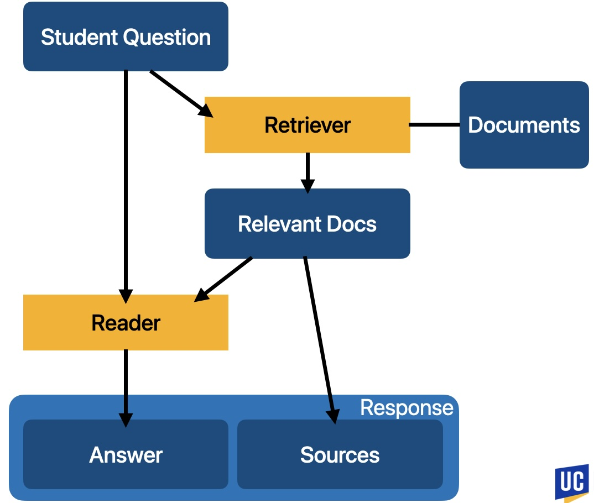

This architecture is the standard retrieval-agumented generation pipeline,
which popular services like Perplexity and Otter AI uses.

## Data

We analyzed course forums and categorize students' questions into 4 types.  
We then collect the corresponding information as document sources.  
The statistics of 2 classes show that 80% of the questions are assignment clarification or troubleshooting.

| Question Type | Content Type | UCR CS 203 | UCSD CSE 142 |
| :- | :- | :-: | :-: |
| Course concepts | Textbook, readings | 1.37% | 0.85% |
| Assignments | Assignment Questions | 47.95% | 43.16% |
| Logistics | Syllabus, course website | 16.44% | 13.68% |
| Troubleshooting | Troubleshooting FAQ | 34.25% | 42.31% |

## Retriever

### Build Stage

In the build stage, every document source is chunked up into documents.  
The documents are fed into the embedding model, which produces vector embeddings.
Theses embeddings form a vector index.

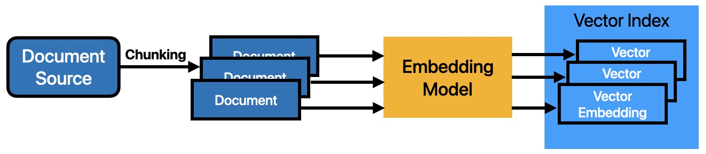

### Deployment

During deployment, the embedding model first creates a query vector embedding from the student query.  
We then perform a nearest neighbor search of the query embedding against the vector index,
selecting the top K most relevant documents.

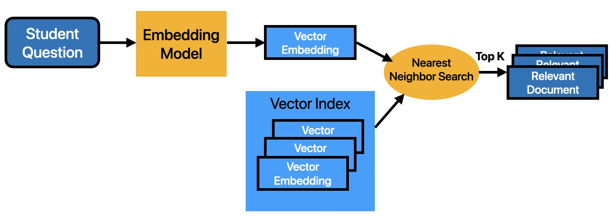

### Configuration

We first limit our total number of document tokens to 2500. This means that larger chunk sizes have a smaller maximum top K value.  
We also test different overlap ratio, the percentage of overlapping content 2 documents can have.

| Chunk Size (words) | N Tokens / Chunk | Top K |
| :-: | :-: | :- |
| 128 | 120 | 5, 10, 15, 20 |
| 256 | 250 | 5, 10 |
| 512 | 500 | 5 |

### Experimental Results 1

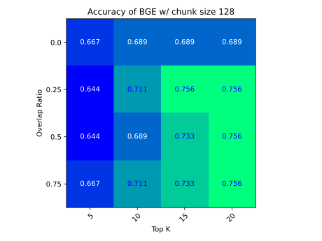
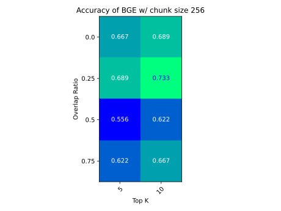
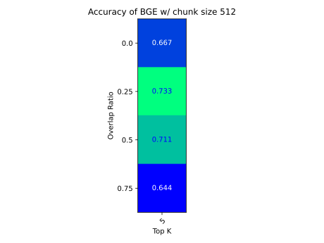

Experiments show that larger top K always improves accuracy.

### Reducing Irrelevant Documents

We compare 2 setups:

- Setting a distance theshold to limit the minimum amount of similarity
- Ensembling 2 retrievers

We measure the efficacy with OOD drop rate, the average percentage of documents dropped for OOD queries

### Experimental Results 2

Experiments show that accuracy and OOD drop rate is a trade off:

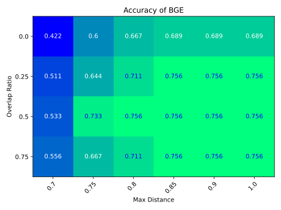
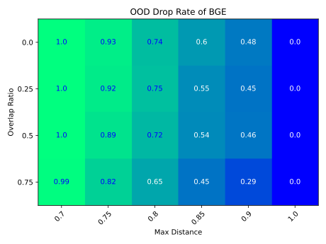

> Above: BGE embedding model

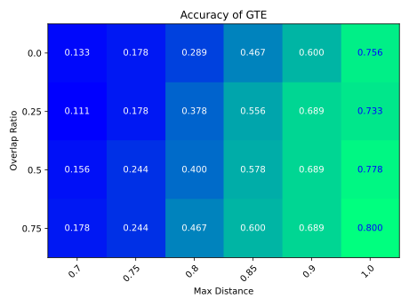
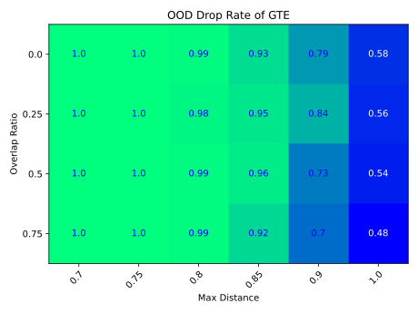

> Above: GTE embedding model

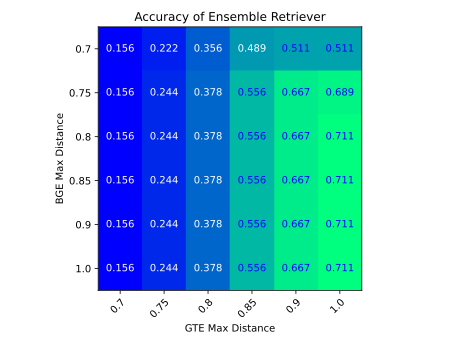
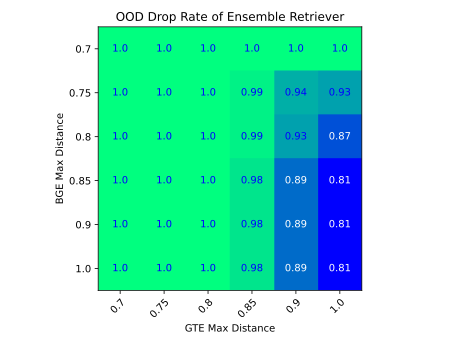

> Above: Ensemble

Plotting out the Pareto curve, we select the configuration with the best OOD drop rate and has at least 70% accuracy.

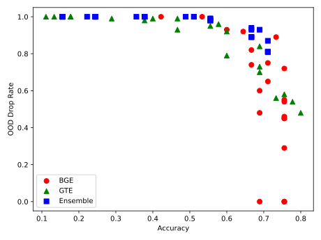

## Reader

Reader is the LLM. We prompt the LLM with student questions and relevant documents.  
Our hardware limits the model choice to sub-3B models, including StableLM Zephyr 3B and Gemma 2B Instruct.

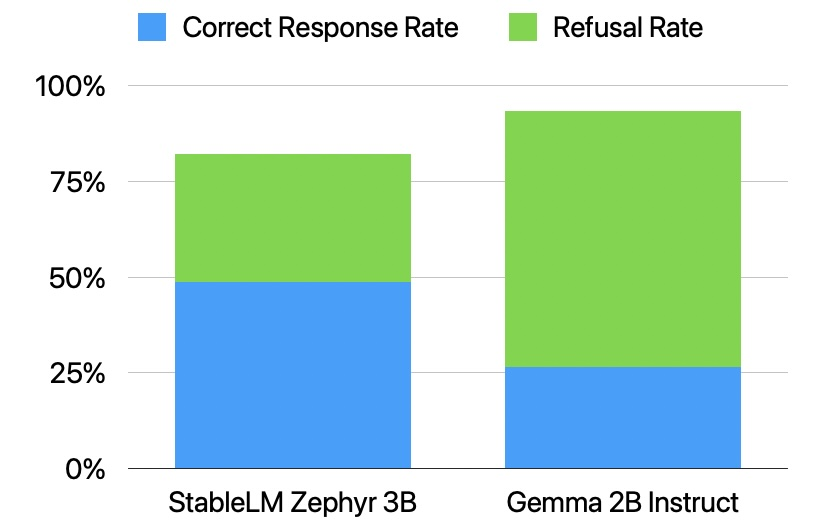

Although Gemma has an overall better good response rate, most of the good responses come from refusals.  
Thus, we choose StableLM for more helpful answers at the cost of a little accuracy.

### Separating Assignment Questions

Our benchmarking shows the reader suffers in answer quality for assignment questions.  
Here's the correct response rate breakdown:

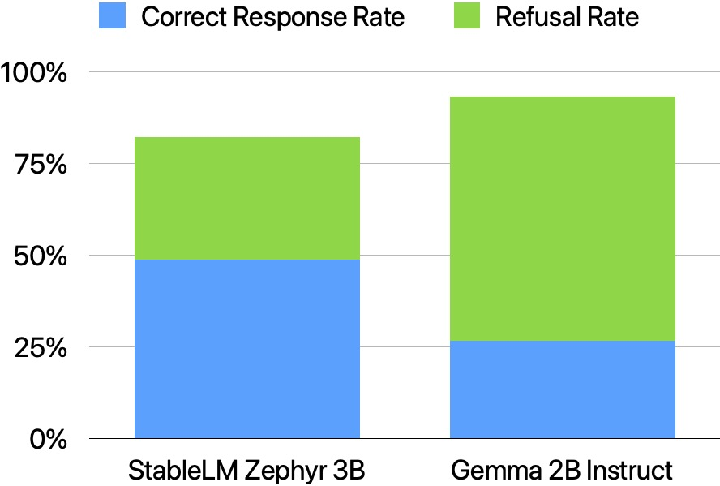

We hypothesize that

- Irrelevant documents mixed into context, lowering answer quality
- Assignment clarification are highly contextual and thus difficult to retrieve correctly

We mitigated this issue by adding a menu to allow users to explicitly select the question.  
The temporary solution improved the assignment question accuracy to 50%.

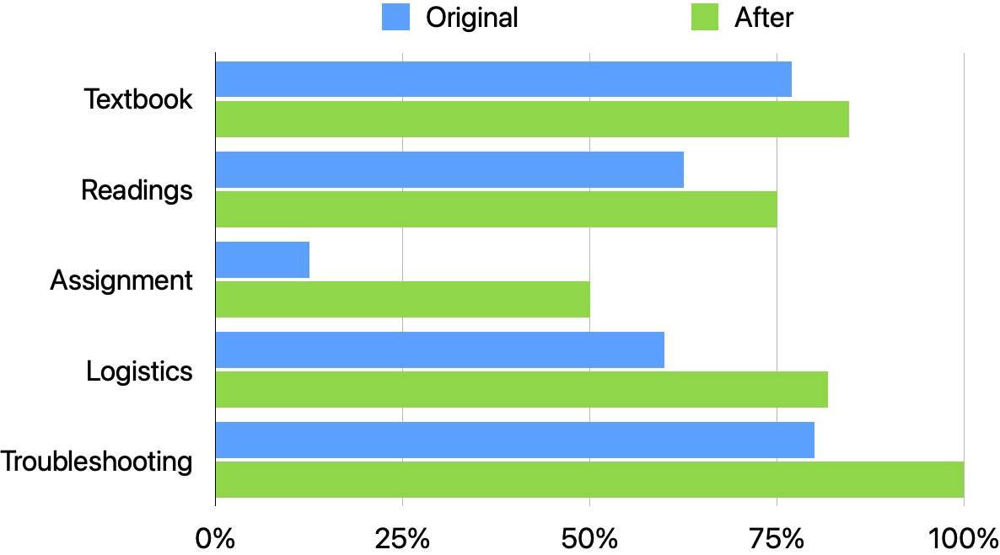

## Future Works

- Better integration with course material formats for easier data processing
- More approachable UI for higher adoption rate
- Real-world user study
